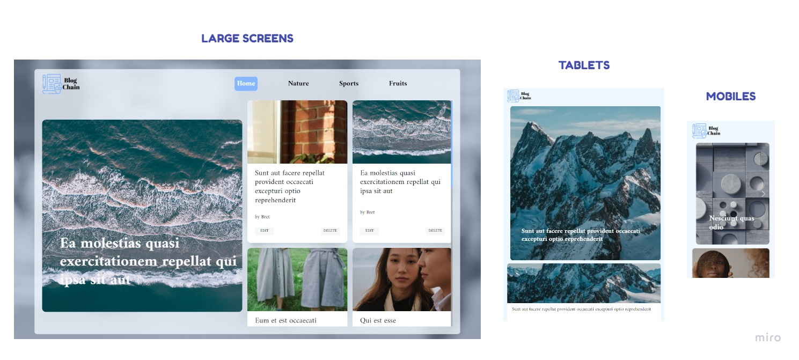

`#html` `#css` `#js` `#dom` `#JSON-server` `#JSON`
<p>&nbsp;</p>


<p>&nbsp;</p>

# Blog CHAIN 

A fast, simple, elegant & powerful blog powered by HTML, CSS and JS Vanilla.

According to a recent survey, blogs have ranked as the third most trustworthy source of information, following only friends and family. That's right — bloggers are trusted more than celebrities, journalists, brands, and politicians.

With this blog we will get people to fall in love with it. Well, just as your website homepage is like the front door to your business, our blog's design is the front door of ourselves.

With an elegant design, and an organized structure, we have created this fashionable blog to read about any topics you want.

<p>&nbsp;</p>

# Preview 


<p>&nbsp;</p>

<h2 align="center">Gold sponsors 🥇❤️</h2>

<p>&nbsp;</p>


<p align="center">
  <a href="https://assemblerinstitute.com/" target="_blank">
    
  </a>
</p>

# Table of contents

<!-- toc -->

- [Getting started](#getting-started)
- [What can you do in blog chain?](#What-can-you-do-in-blog-chain?)
- [Roadmap](#Roadmap)
- [Responsive](#responsive)
- [Technologies](#Technologies)
- [Team](#Team)
- [Links](#links)
  * [Video](#video)
  * [Third-party tools](#third-party-tools)
  * [Linkedin](#Linkedin)


<!-- tocstop -->

# Getting started

First of all, you must launch the local API server created with JSON server to be able to fetch the data to the blog web page.

```
npm run server
```

Also when doing requests, it's good to know that:

- If you make POST, PUT, PATCH or DELETE requests, changes will be automatically and safely saved to `db.json` using [lowdb](https://github.com/typicode/lowdb).
- Your request body JSON should be object enclosed, just like the GET output. (for example `{"name": "Foobar"}`)
- Id values are not mutable. Any `id` value in the body of your PUT or PATCH request will be ignored. Only a value set in a POST request will be respected, but only if not already taken.
- A POST, PUT or PATCH request should include a `Content-Type: application/json` header to use the JSON in the request body. Otherwise it will return a 2XX status code, but without changes being made to the data. 

<p>&nbsp;</p>

# What can you do in blog chain?

<p>&nbsp;</p>

- Read articles about whatever topic you want.
- Modify articles clicking in the edit button of the desired article card.
- Remove articles clicking in the delete button of the desired article card.

<p>&nbsp;</p>

# Roadmap

<p>&nbsp;</p>

### Project Organization 

<p>&nbsp;</p>

We started designing the structure of the blog with its differents html tags and giving it classes and ids.


<p>&nbsp;</p>

# Responsive

<p>&nbsp;</p>

This blog web page is adapted for all type of devices.

- Small devices (mobiles 360px and up)
- Medium devices (landscape tablets, 768px and up) */
- Large devices (laptops/desktops, 992px and up) */
- Extra large devices (large laptops and desktops, 1200px and up) */




<p>&nbsp;</p>

# Technologies

- HTML 
- CSS 
- JAVASCRIPT VANILLA 
- JSON SERVER
- BOOTSTRAP 5 

<p>&nbsp;</p>

# Team

- 🕺 Ivan Escribano (https://github.com/ivan-escribano)
- 💃 Alicia Cembranos (https://github.com/alicembranos)

<p>&nbsp;</p>

# Links

## Video


<p>&nbsp;</p>

## Third-party tools

* [JSON Server](https://github.com/typicode/json-server/blob/master/README.md)

<p>&nbsp;</p>

## Linkedin

[](https://www.linkedin.com/in/ivan-escribano-382671217/) Ivan Escribano

[](https://www.linkedin.com/in/aliciacembranos/) Alicia Cembranos


